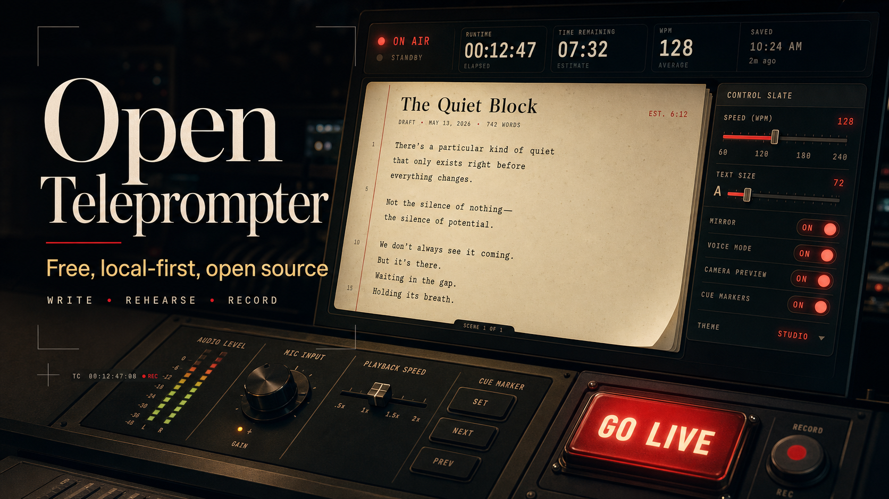

# Open Teleprompter

A local-first teleprompter for writing, importing, rehearsing, and recording scripts.



## Features

- Script editor with autosave in the browser
- Import `.txt`, `.pdf`, and `.docx` files
- Export scripts as `.txt`
- Saved script queue stored in `localStorage`
- Live prompter with fixed, timed, and voice-assist modes
- Mirror controls for beam-splitter glass
- Camera preview and recording with browser MediaRecorder fallback
- Keyboard controls for live use

## Tech Stack

- Astro
- React
- Tailwind CSS
- Vitest

The app is fully client-side. It does not require a backend, database, or environment variables.

## Getting Started

```sh
npm install
npm run dev
```

Open `http://localhost:4321`.

## Scripts

```sh
npm run test
npx astro check
npm run build
npm run preview
```

## Keyboard Controls

- `Space`: play or pause
- `ArrowUp` / `ArrowDown`: adjust speed or timed reading pace
- `ArrowLeft` / `ArrowRight`: adjust text size
- `R`: restart
- `M`: cycle mirror mode
- `Esc`: exit prompter

## Browser Notes

Voice mode depends on browser speech APIs. Chrome-based browsers currently provide the best support. If transcript matching is unavailable or unreliable, the app falls back to voice-assist behavior that advances while speech is detected.

Recording depends on `MediaRecorder` support. The recorder tries VP9, then VP8, then the browser default.

## Privacy

Scripts and settings are stored locally in the browser with `localStorage`. No script text is sent to a server by this app.

## License

MIT
